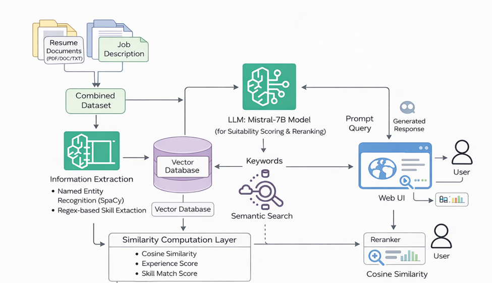

# 🤖 AI-Powered Resume Screening & Candidate Ranking

An AI-assisted resume screening and candidate ranking framework that combines
resume information extraction, skill matching, experience analysis, semantic
similarity, and Large Language Model (LLM) evaluation.

---

## 📌 Overview

Recruitment teams may need to process large numbers of resumes for a single
job opening. This project explores an automated approach for extracting
structured information from resumes and evaluating candidate-job relevance.

The framework processes resumes from multiple document formats and extracts
information such as skills, education, experience, projects, achievements,
CGPA, email, and phone information.

It applies multiple approaches to candidate evaluation, including:

- Rule-based information extraction
- Skill and feature-based matching
- Experience and project analysis
- TF-IDF-based matching
- Semantic similarity using Sentence Transformers
- LLM-assisted resume evaluation using Mistral 7B through Ollama

---

## 🎯 Objectives

- Automate the extraction of relevant information from resumes.
- Identify candidate skills and professional experience.
- Analyze projects and achievements.
- Calculate candidate-job matching scores.
- Compare lexical and semantic matching approaches.
- Explore LLM-assisted candidate evaluation.
- Develop an interpretable candidate ranking framework.

---

## 🏗️ System Workflow

```text
Resume Documents
       │
       ▼
┌─────────────────────────┐
│ Resume Text Extraction  │
│ PDF • DOCX • TXT • OCR  │
└────────────┬────────────┘
             │
             ▼
┌─────────────────────────┐
│ Information Extraction  │
│                         │
│ • Skills                │
│ • Education             │
│ • Experience            │
│ • Projects              │
│ • Achievements          │
│ • CGPA                  │
└────────────┬────────────┘
             │
             ▼
┌─────────────────────────┐
│ Candidate Feature       │
│ Processing              │
└────────────┬────────────┘
             │
       ┌─────┼──────────────┐
       ▼     ▼              ▼
    TF-IDF  Semantic       LLM
            Similarity   Evaluation
       │     │              │
       └─────┼──────────────┘
             ▼
┌─────────────────────────┐
│ Candidate Matching      │
│ & Ranking               │
└─────────────────────────┘
```

---



## 📄 Resume Processing

The system supports resume documents in the following formats:

- PDF
- DOCX
- TXT
- JPG
- JPEG
- PNG

Text extraction is performed using format-specific processing tools, while
OCR is used for image-based resumes.

---

## 🔍 Information Extraction

The framework extracts structured candidate information including:

| Feature | Description |
|---|---|
| Name | Candidate name |
| Email | Email address |
| Phone | Contact number |
| Skills | Identified technical and professional skills |
| CGPA | Academic CGPA/GPA when available |
| Experience | Estimated years of experience |
| Education | Educational information |
| Projects | Project-related information |
| Achievements | Candidate achievements |
| Experience Details | Professional experience information |

spaCy and regular-expression-based processing are used for several extraction
tasks.

---

## 🧠 Candidate Matching Approaches

### 1. Skill & Feature-Based Matching

Candidate features are evaluated using:

- Skill matching
- Project count
- Achievement count
- Years of experience

The current implementation uses the following weighted scoring scheme:

| Feature | Weight |
|---|---:|
| Skill Matching | 40% |
| Project Score | 20% |
| Achievement Score | 20% |
| Experience Score | 20% |

The resulting score is used to support candidate comparison and ranking.

---

### 2. TF-IDF-Based Matching

TF-IDF is used to represent textual information and measure lexical similarity
between candidate information and job requirements.

Cosine similarity is used to calculate the degree of textual relevance.

---

### 3. Semantic Similarity

The project uses the Sentence Transformers model:

```text
all-MiniLM-L6-v2
```

The model generates semantic embeddings for job descriptions and candidate
information.

Cosine similarity is then used to measure semantic relevance between the
candidate information and job description.

---

### 4. LLM-Based Evaluation

The project also explores LLM-assisted candidate evaluation using:

```text
Mistral 7B + Ollama
```

The LLM receives a job description and resume summary and produces:

- A match score on a 0–100 scale
- A short textual explanation for the score

This component is intended as an additional evaluation approach rather than
a replacement for the structured matching methods.

---

## 📊 Candidate Ranking

The feature-based matching stage produces candidate-level information such as:

- Match Score
- Experience Years
- Skills
- Project Score
- Achievement Score

Candidates can then be sorted according to their calculated matching scores.

---

## 🛠️ Technologies

### Programming & Environment

- Python
- Google Colab

### Natural Language Processing

- spaCy
- Regular Expressions
- Sentence Transformers

### Machine Learning

- Scikit-learn
- TF-IDF
- Cosine Similarity

### Large Language Models

- Mistral 7B
- Ollama

### Document Processing

- PyMuPDF
- pdfplumber
- python-docx
- Tesseract OCR
- Pillow

### Data & Visualization

- Pandas
- NumPy
- Matplotlib
- Seaborn

---

## 📁 Project Structure

```text
AI-Resume-Screening/
│
├── AI_Resume_Screening.ipynb
├── README.md
├── requirements.txt
│
└── data/
    └── README.md
    └── synthetic_resumes.csv
```

The original resume dataset is intentionally excluded from this public
repository because resume documents may contain personally identifiable
information.

---

## 🚀 How to Run

### 1. Clone the repository

```bash
git clone https://github.com/shifat1112/AI-Resume-Screening.git
cd AI-Resume-Screening
```

### 2. Install Python dependencies

```bash
pip install -r requirements.txt
```

### 3. Install the spaCy English model

```bash
python -m spacy download en_core_web_sm
```

### 4. Prepare your own resume dataset

Use appropriately sourced and anonymized resume documents for experimentation.

Do not upload resumes containing personal or sensitive information to this
public repository.

### 5. Open the notebook

Open:

```text
AI_Resume_Screening.ipynb
```

The notebook can be executed using Google Colab or a compatible Python/Jupyter
environment.

---

## ⚠️ LLM Component

The project includes an optional local LLM component using Mistral through
Ollama.

The LLM component requires Ollama to be installed and the required Mistral
model to be available locally.

This component is optional. The resume extraction and candidate-matching
stages can be explored independently of the local LLM component.

---

## 🔬 Research Focus

This project explores the application of Natural Language Processing (NLP),
semantic representation, structured candidate features, and local Large
Language Models (LLMs) for automated resume screening.

The framework considers multiple candidate attributes, including skills,
experience, education, projects, achievements, and other extracted resume
information, rather than relying solely on keyword matching.

---

## ⚠️ Limitations

The current implementation has several limitations:

- Resume formats and layouts can vary considerably.
- Rule-based extraction may not capture every resume structure.
- Skill matching depends partly on the available skill vocabulary.
- Semantic similarity does not necessarily represent recruiter judgment.
- LLM-generated scores may vary depending on the model and prompt.
- The current experiments do not establish that automated scores are
  equivalent to human recruiter evaluations.
- Bias and fairness require further investigation using appropriate datasets
  and evaluation methods.

---

## 🔮 Future Work

Potential extensions include:

- Improved resume section detection
- More robust skill normalization
- Better semantic candidate-job matching
- Explainable candidate scoring
- Bias and fairness analysis
- Larger and more diverse datasets
- Evaluation against human recruiter judgments
- Improved LLM-based reasoning
- Web-based deployment
- Candidate-job matching across multiple job categories

---

## 👨‍💻 Author

**Md. Shifat Ahmed**

B.Sc. in Computer Science & Engineering  
Daffodil International University

**Research Interests:** Artificial Intelligence • Machine Learning • NLP •
Generative AI • Intelligent Systems

GitHub: [@shifat1112](https://github.com/shifat1112)
